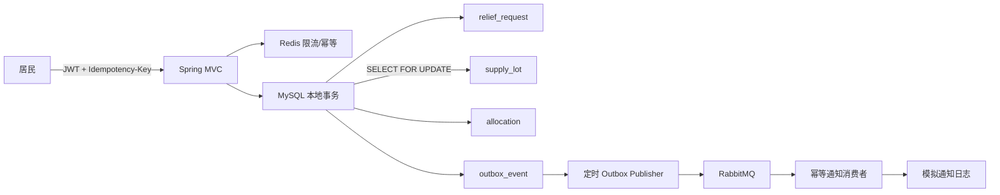

# Urban Resilience Hub（城市韧性共享站）

一个可运行、纯 Java 的 Spring Boot 后端项目。它解决的不是常见的商城下单，而是：灾害或极端天气发生时，居民提交物资请求，平台从同辖区共享站按“先过期先出库（FEFO）”动态锁定物资，并以可靠事件驱动通知。

这个场景天然包含后端面试最爱追问的库存并发、一致性、缓存、幂等、消息重复、鉴权、数据库索引和故障降级。

## 技术栈

- Java 21、Spring Boot 4.1.1、Spring MVC、Bean Validation
- Spring Data JPA / Hibernate、MySQL 8.4、Flyway
- Redis 7.4：Cache Aside、幂等键、固定窗口限流、消息消费去重
- RabbitMQ 4.1：Topic Exchange、至少一次投递、消费端幂等
- Spring Security：无状态认证、手写标准 HS256 JWT、RBAC
- Actuator、Micrometer Prometheus、MDC Trace ID
- JUnit 5、Mockito、Testcontainers 依赖
- Docker Compose、Maven Wrapper、Dockerfile

## 一条请求如何流动



## 5 分钟启动

要求：JDK 21+、Docker Desktop。无需预装 Maven，首次构建时 wrapper 会下载 Maven。

```bash
docker compose up -d
./mvnw spring-boot:run
```

Windows PowerShell：

```powershell
docker compose up -d
.\mvnw.cmd spring-boot:run
```

服务地址为 `http://localhost:8080`，RabbitMQ 控制台为 `http://localhost:15672`（`app/app123`）。

浏览器打开服务地址即可进入社区物资服务前端，运行无需安装 Node.js。前端静态资源由 Spring Boot 直接托管，使用表格和表单组织求助工作台、记录查询、共享站查询与工作人员分配操作，共用 JWT 鉴权。没有地图、虚构库存统计或装饰性图表。

居民与工作人员均使用服务端分页查询，支持跨设备访问；居民只可见自己的记录，工作人员可见全部记录。编号与状态筛选作用于全部数据范围，每页 20 条。详情包含状态、紧急程度和提交时间，工作人员可逐条发起分配。

前端交互回归测试可用 `node --test tests/frontend.test.cjs` 运行（仅开发验证需要 Node.js）。覆盖记录刷新、分页失败恢复、跨设备记录来源、响应乱序、权限处理与内容转义。视觉样式统一维护在 `src/main/resources/static/assets/workspace.css`。

演示账号（仅本地初始化数据）：

| 用户 | 密码 | 角色 |
|---|---|---|
| `citizen` | `User@123` | 居民 |
| `admin` | `Admin@123` | 管理员 |

生产环境必须替换数据库密码和 `JWT_SECRET`，初始化演示账号也应删除或迁移为 BCrypt 密码。

## API 演示

登录：

```bash
curl -s http://localhost:8080/api/auth/login \
  -H 'Content-Type: application/json' \
  -d '{"username":"citizen","password":"User@123"}'
```

把响应中的 `accessToken` 放入环境变量 `TOKEN`，然后创建求助单：

```bash
curl -s http://localhost:8080/api/relief-requests \
  -H "Authorization: Bearer $TOKEN" \
  -H 'Idempotency-Key: demo-request-001' \
  -H 'Content-Type: application/json' \
  -d '{"district":"浦东新区","category":"WATER","quantity":20,"priority":"HIGH"}'
```

管理员登录后执行分配（替换编号）：

```bash
curl -s -X POST http://localhost:8080/api/relief-requests/RR20260930XXXXXXXXXXXX/allocate \
  -H "Authorization: Bearer $ADMIN_TOKEN"
```

其他端点：

| 方法 | 路径 | 权限 | 目的 |
|---|---|---|---|
| `GET` | `/api/shelters?district=浦东新区` | 登录 | Redis Cache Aside 查询 |
| `GET` | `/api/relief-requests/{requestNo}` | 记录所有者或 ADMIN | 不可见记录返回 404 |
| `GET` | `/api/relief-requests?page=0&size=20` | 登录 | 居民仅本人；支持 keyword、status；size 最大 100 |
| `POST` | `/api/relief-requests/{requestNo}/allocate` | ADMIN | 并发安全分配 |
| `GET` | `/actuator/health` | 公开 | 存活/依赖健康检查 |
| `GET` | `/actuator/prometheus` | ADMIN | Prometheus 指标 |

## 超详细学习文档

- [学习文档总目录](docs/README.md)
- [后端学习手册：22 章](docs/后端学习手册.md)
- [实验手册：16 组实验](docs/实验手册.md)
- [55 个面试问题与 10 个进阶练习](docs/面试问答与进阶练习.md)
- [改造内容与验收证据](docs/改造与验收.md)

真实 API 验证：运行 `node tests/api-smoke.mjs`，需要已启动服务，会新增两张演示请求并预留 1 份饮用水。

## 面试知识点地图

| 主题 | 项目中的实现 | 常见追问与答案方向 |
|---|---|---|
| IOC / AOP | 构造器注入、`@Audited` 切面 | Bean 生命周期、代理失效、自调用问题 |
| MVC | Controller / Service / Repository 分层 | Filter、Interceptor、AOP 的顺序和适用边界 |
| 参数校验 | DTO + Jakarta Validation | 为什么不直接接收 Entity |
| 事务 | 分配方法本地事务，锁内不远程调用 | 传播行为、隔离级别、回滚条件 |
| 并发库存 | `PESSIMISTIC_WRITE` + FEFO | 乐观锁适合低冲突；悲观锁适合热点库存；注意死锁顺序 |
| 乐观锁 | Entity `@Version` | CAS、ABA、失败重试和饥饿 |
| MySQL | 规范化表、联合索引、唯一约束 | B+Tree、最左前缀、覆盖索引、回表、Explain |
| Redis | Cache Aside、TTL 抖动、缓存空值 | 穿透/击穿/雪崩；一致性策略；热点 Key |
| 幂等 | Redis `SET NX` + DB 唯一键兜底 | 为什么仅 Redis 不够；处理中崩溃时 TTL 如何选 |
| 限流 | IP 固定窗口、Redis 故障 fail-open | 滑动窗口、令牌桶；安全接口可选择 fail-close |
| MQ | RabbitMQ Topic、消息 ID | 至少一次语义；重复/乱序/积压/死信 |
| 分布式事务 | Transactional Outbox | 为什么不能“先写库再发消息”；CDC 替代轮询 |
| 安全 | HS256 JWT、RBAC、无状态会话 | XSS/CSRF/CORS；密钥轮换；Token 撤销 |
| 可观测性 | Trace ID、Actuator、Prometheus | RED/USE 指标、日志脱敏、告警阈值 |
| JVM | Java 21、容器内存参数、虚拟线程 | 堆/栈/元空间、GC、逃逸分析、线程池阻塞 |
| 测试 | 单元测试 + Testcontainers 依赖 | 测试金字塔、事务测试假阳性、契约测试 |

## 为什么这样设计

### 防超卖

先锁求助行并检查 PENDING，再锁同辖区可用库存；按有效期和 ID 排序，无有效期批次放最后。预留量、分配明细、请求状态和 Outbox 同事务提交。当前是库存预留，尚未实现实物出库和部分分配补单。

### 可靠消息

业务与 Outbox 同事务提交。发布器等待 broker confirm 并检查 mandatory return，确认且可路由才标记已发布；发送成功但标记前宕机仍会重复投递。消费者用 Redis 去重并写模拟日志，不能保证真实短信副作用恰好一次。

### 缓存一致性

共享站查询采用 Cache Aside：先读缓存，未命中读库并回填；缓存空结果阻止穿透，TTL 抖动防雪崩。当前共享站资料无写接口；增加写接口时应“先提交数据库，再删除缓存”，必要时通过延迟双删或 Binlog CDC 提高一致性。

### 可继续演进的边界

当前是模块化单体，部署简单、事务明确。规模上来后可按 `request`、`inventory`、`dispatch`、`notification` 拆服务，Outbox 事件就是天然边界。不要为了简历先拆微服务，再用大量分布式事务补救原本不存在的问题。

## 数据库与性能练习

推荐在 MySQL 中练习：

```sql
EXPLAIN ANALYZE
SELECT * FROM supply_lot
WHERE category = 'WATER'
  AND expires_at > NOW()
ORDER BY expires_at, id;
```

观察现有 `idx_supply_match(category, expires_at, shelter_id)` 是否满足你的具体数据分布。`quantity > reserved_quantity` 是列间比较，普通 B+Tree 很难直接优化；数据量大时可以维护 `available_quantity` 或使用生成列，但会增加写入和一致性成本。

## 测试与打包

```bash
./mvnw test
./mvnw clean package
docker build -t urban-resilience-hub:0.1.0 .
```

## 目录结构

```text
src/main/java/com/example/resilience
├── audit       # AOP 审计
├── common      # 统一响应、异常、Trace ID
├── config      # Security / RabbitMQ 配置
├── domain      # JPA 领域实体与状态机
├── repository  # 数据访问、锁与索引对应查询
├── security    # JWT、RBAC、限流
├── service     # 事务、幂等、缓存、Outbox
└── web         # REST API 与 DTO

src/main/resources/static
├── index.html   # 单页应用结构与无障碍语义
└── assets       # 原生 JavaScript 交互与响应式视觉系统
```

项目刻意保留了可讨论的生产化改进项：密钥托管、JWT 黑名单/刷新令牌、真实通知任务、Outbox 多实例 `SKIP LOCKED`、分布式追踪、压测、CDC、数据归档与读写分离。这些适合作为二面系统设计的延伸，而不是悄悄藏在“已完成”里。
